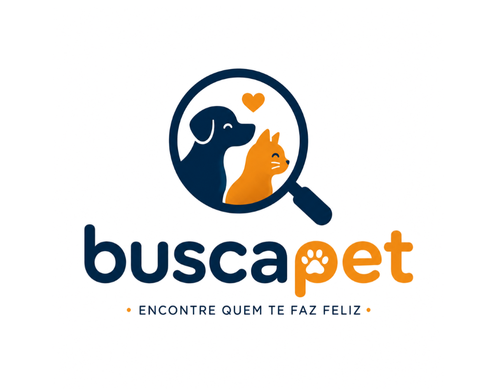

# 🐾 BuscaPet: Reencontro e Adoção com Inteligência Artificial

> **Plataforma web que ajuda tutores a reencontrar animais perdidos por similaridade visual, conecta adotantes a abrigos e organiza doações para quem cuida.**

O **BuscaPet** é uma plataforma web dividida em quatro componentes que se comunicam por HTTP — o destaque é o núcleo de similaridade visual, escrito em C com OpenCL, que atende à disciplina de Tópicos Avançados. Documentação viva do escopo, arquitetura e decisões fica versionada junto ao código.

---

## 🎯 O Problema

Abrigos e protetores independentes de animais operam, em sua maioria, sem nenhum sistema de gestão — controle em cadernos ou planilhas, divulgação limitada ao alcance de redes sociais, e nenhum mecanismo organizado para reencontrar um animal perdido. Quem perde um pet depende de sorte e de postagens espalhadas em grupos, sem qualquer comparação sistemática entre quem procura e quem encontrou.

## ✨ Funcionalidades Principais

* 🏠 **Adoção:** mapa de abrigos e protetores, catálogo de animais disponíveis, filtros de busca.
* 🔍 **Reencontro por Similaridade Visual:** núcleo computacional do projeto — compara a foto de quem perdeu um animal contra o acervo de abrigos e os avistamentos da comunidade, com monitoramento contínuo e alerta automático.
* 🤝 **Rede de Doações:** mural de necessidades dos abrigos e ranking de apoiadores (petshops, clínicas, distribuidoras), ponderado por regularidade e não só volume.
* 🔓 **Login Único e Acesso Livre:** visitante navega, consulta e até executa busca por foto sem cadastro — só precisa logar para agir (registrar perdido, salvar busca, contatar abrigo).

---

## 🛠️ Stack Tecnológica

| Camada | Tecnologia | Descrição |
| :--- | :--- | :--- |
| **Backend** | `FastAPI + SQLAlchemy` | API REST assíncrona, autenticação JWT, regras de negócio |
| **Núcleo de IA** | `C + OpenCL (PoCL)` | Comparação de similaridade visual — processamento paralelo, serviço HTTP isolado do backend |
| **Banco de dados** | `PostgreSQL (Supabase)` | Modelo relacional com suporte a PostGIS para busca por raio |
| **Fila** | `Redis + RQ` | Monitoramento contínuo das buscas ativas |
| **Ambiente** | `Docker Compose` | 5 serviços orquestrados localmente (`api`, `nucleo-opencl`, `frontend`, `db`, `redis`) |
| **Design** | `Figma` | Protótipo em alta-fidelidade das telas |

---

## 👥 Time de Desenvolvimento

| Integrante | Frente | GitHub |
| :--- | :--- | :--- |
| **Nivaldo José de Arruda Filho** | Banco de dados, documentação e núcleo OpenCL | [@N1VV4](https://github.com/N1VV4) |
| **Kaian Guthierry da Silva** | Backend, integração e DevOps, apoio ao núcleo | [@kkaian](https://github.com/kkaian) |
| **Marlon Porto Torres** | Frontend, UX e roteiro dos vídeos | [@marlonportotorres4](https://github.com/marlonportotorres4) |

---

## 📦 Repositórios

| Repositório | O que tem |
| :--- | :--- |
| [**BuscaPet-App**](https://github.com/Equipe-BuscaPet/BuscaPet-App) | Código-fonte: backend (`api/`, FastAPI), núcleo de similaridade visual (`nucleo-opencl/`, C + OpenCL), frontend e ambiente Docker |
| [**Documentos**](https://github.com/Equipe-BuscaPet/Documentos) | Escopo, requisitos, entregas de cada Sprint, diagramas de arquitetura/classes/MER e protótipos de tela |

## 🎓 Contexto Acadêmico

Projeto desenvolvido para o curso de Ciência da Computação da Universidade Maurício de Nassau (UNINASSAU) — Recife, integrando três disciplinas do semestre: **Fábrica de Software** (construção do sistema), **Tópicos Avançados** (núcleo de processamento paralelo em OpenCL) e **Atividades Práticas Interdisciplinares de Extensão IV** (capacitação digital de uma instituição parceira de proteção animal). Entrega final prevista para **05/12/2026**.

[Protótipo das telas principais no Figma →](https://www.figma.com/design/hRa8GLWzc4vvVToGGQ4Zxe/Untitled?node-id=0-1)

Desenvolvido com 🐾 pelo Time BuscaPet.

